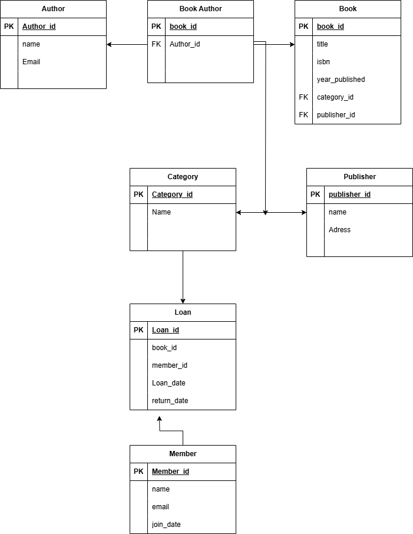

# Library Management System

## Description
This project implements a full-featured Library Management System using MySQL. It includes tables for Authors, Publishers, Categories, Books, Members, and Loans, with proper relationships and constraints.

## How to Run/Setup
1. Clone the repository.
2. Open your MySQL environment and run the following command to create the database:
   ```sql
   CREATE DATABASE IF NOT EXISTS library_management;
   ```
3. Import the `library_management.sql` file into your MySQL environment.
4. Run the SQL script to create the database schema.

## ERD

*Entity Relationship Diagram showing the database structure* 